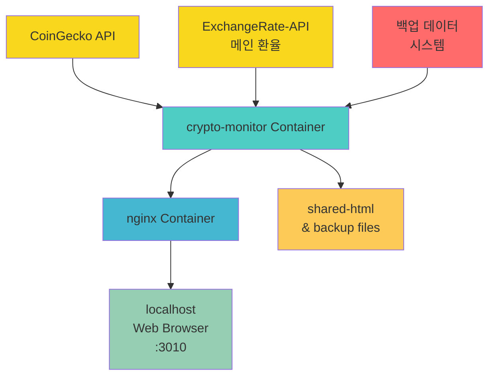
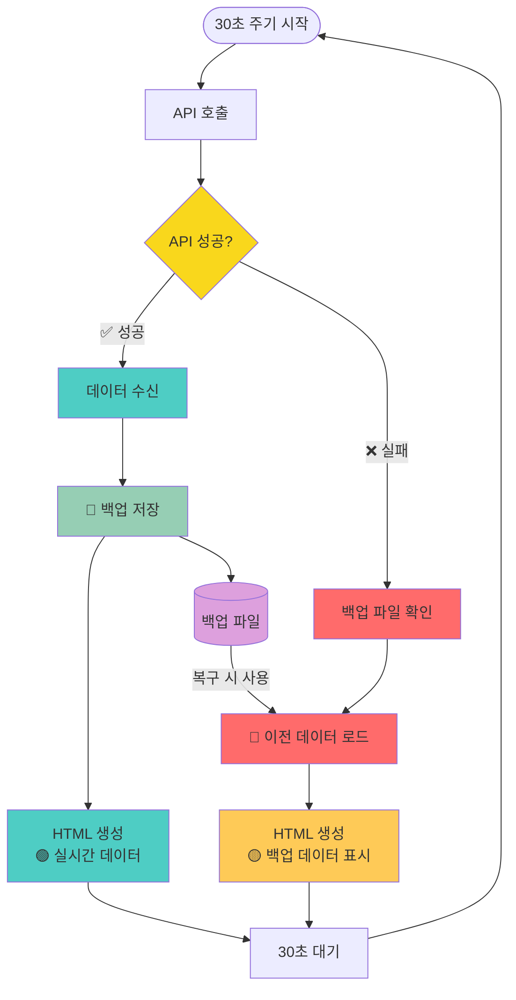

# 5조 기말 프로젝트 - 실시간 암호화폐 모니터링 시스템

## 프로젝트 개요
Docker Compose와 외부 API를 활용한 자동화된 웹 서버 구축 프로젝트입니다.  
실시간 암호화폐 가격 정보와 환율 정보를 주기적으로 업데이트하여 웹페이지로 제공합니다.

## 기획

### 주제 선정 이유
- **실시간성**: 암호화폐는 24/7 가격이 변동하므로 실시간 모니터링이 중요
- **실용성**: 한국 사용자를 위한 원화 환산 기능 제공
- **기술 적용**: Docker, API, Cron 등 수업 내용을 종합적으로 활용
- **차별화**: 단순 표시가 아닌 실시간 환율 적용으로 정확한 원화 계산

### 목표
- 상위 12개 암호화폐의 실시간 가격 모니터링  
- 실시간 환율을 적용한 정확한 원화 계산
- 30초 간격 자동 업데이트로 최신 정보 제공
- 직관적이고 현대적인 UI/UX 제공
- 안정적인 서비스 운영을 위한 다중 백업 시스템

## 구현 설명

### 시스템 아키텍처



### 백업 시스템 작동 방식



**백업 파일 구조:**
```
/shared/backup/
├── last_success.json     # 암호화폐 데이터 백업
└── last_exchange.txt     # 환율 데이터 백업
```

**상태 표시:**
- 🟢 실시간 데이터 (API 성공)
- 🟡 백업 데이터 표시 중 (API 실패)  
- 🔴 데이터 없음 (백업도 없음)

### 핵심 기능

#### 1. API 불안정성 해결을 위한 백업 시스템
**문제**: API 서비스의 간헐적 장애로 인한 데이터 손실 및 서비스 중단
**해결책**: 
- **데이터 백업 저장**: 성공한 API 응답을 로컬 파일에 자동 저장
- **자동 복구**: API 실패 시 즉시 백업 데이터로 전환
- **상태 시각화**: 실시간/백업 데이터 상태를 사용자에게 명확히 표시
- **서비스 연속성**: API 장애와 무관하게 항상 데이터 제공

**백업 파일 구조**:
```
/shared/backup/
├── last_success.json     # 마지막 성공한 암호화폐 데이터
└── last_exchange.txt     # 마지막 성공한 환율 데이터
```

#### 2. 실시간 데이터 수집 및 복원
- **암호화폐 데이터**: 가격, 순위, 24시간 변동률, 로고
- **환율 데이터**: USD/KRW 실시간 환율
- **데이터 검증**: jq를 사용한 JSON 유효성 검사
- **자동 백업**: 성공 시마다 백업 파일 업데이트

#### 3. 자동화 시스템 (API 안정성 고려)
- **Cron 설계**: 2개 작업으로 30초 간격 구현 (API 부하 감소)
- **실행 주기**: 매분 0초, 30초에 실행
- **즉시 실행**: 컨테이너 시작 시 첫 데이터 수집
- **부하 분산**: API 호출 빈도를 줄여 안정성 향상

#### 4. 데이터 처리 및 포맷팅
- **JSON 파싱**: jq 라이브러리를 사용한 정확한 파싱
- **환율 계산**: bc 명령어로 정확한 소수점 계산
- **숫자 포맷팅**: 천 단위 콤마, 소수점 자리수 최적화
- **오류 처리**: 계산 실패 시 기본값 제공

#### 5. 현대적 웹 인터페이스
- **반응형 디자인**: CSS Grid 레이아웃
- **글래스모피즘**: 투명도와 블러 효과
- **상태 표시**: 가격 변동률에 따른 색상 코딩 (상승/하락/중립)
- **자동 새로고침**: 30초마다 페이지 자동 업데이트
- **백업 알림**: 이전 데이터 사용 시 명확한 상태 표시

## 기술 스택 및 선택 이유

### 컨테이너화
- **Docker**: 환경 독립성 보장
- **Docker Compose**: 다중 컨테이너 오케스트레이션
- **Volume 공유**: 컨테이너 간 데이터 공유

### 웹 서버
- **nginx**: 정적 파일 서빙에 최적화, 높은 성능
- **포트 매핑**: 3010 포트로 외부 접근

### 스케줄링 및 스크립팅
- **cron**: 리눅스 표준 스케줄러
- **bash**: 시스템 표준 스크립트, 추가 패키지 불필요
- **curl**: HTTP 요청을 위한 표준 도구
- **jq**: JSON 파싱을 위한 전문 도구

### API 선택
- **CoinGecko API**: 무료, 신뢰성, 완전한 데이터
- **ExchangeRate-API**: 안정적인 환율 서비스 (메인)
- **백업 시스템**: 로컬 파일 기반 데이터 복구

## API 상세 분석

### CoinGecko API
```
URL: https://api.coingecko.com/api/v3/coins/markets
파라미터:
- vs_currency=usd: 기준 통화
- order=market_cap_desc: 시가총액 정렬
- per_page=15: 여유분 포함 15개 요청
- page=1: 첫 페이지
```
- **무료 한도**: 월 10,000회 (Demo Plan)
- **현재 사용량**: 월 약 86,400회 (30초 간격 적용)
- **API 키 불필요**: CoinGecko Demo Plan은 API 키 없이 사용 가능
- **안정성 개선**: API 실패 시 백업 데이터 자동 사용
- **보안**: 공개 API이므로 별도의 인증 정보 관리 불필요

### ExchangeRate-API
```
URL: https://api.exchangerate-api.com/v4/latest/USD
응답 형식: {"rates": {"KRW": 1376.48, ...}}
```
- **특징**: 무료, 안정적, 실시간 업데이트
- **API 키 불필요**: 공개 API로 별도 인증 없이 사용 가능
- **백업 전략**: API 실패 시 이전 성공 데이터 사용
- **복구 기능**: 연결 복구 시 자동으로 새 데이터로 전환
- **보안**: 민감한 정보 없이 환율 데이터만 처리

## 창의적 기술 구현

### 1. Cron 30초 간격 구현 (API 안정성 고려)
```bash
# API 부하를 줄이기 위해 30초 간격으로 최적화
echo "*/1 * * * * root /usr/local/bin/update.sh" > /etc/cron.d/crypto-cron
echo "*/1 * * * * root sleep 30 && /usr/local/bin/update.sh" >> /etc/cron.d/crypto-cron
```

### 2. 백업 데이터 자동 관리 시스템
```bash
# 성공 시 백업 저장
cp /tmp/crypto_data.json "$LAST_SUCCESS_FILE"
echo "$usd_rate|$exchange_source|$(date)" > "$LAST_EXCHANGE_FILE"

# 실패 시 백업 복원
if [ -f "$LAST_SUCCESS_FILE" ]; then
    cp "$LAST_SUCCESS_FILE" /tmp/crypto_data.json
fi
```

### 3. jq를 사용한 정확한 JSON 파싱
```bash
# 기존 정규표현식 방식 대신 jq 사용으로 안정성 향상
name=$(jq -r ".[$i].name" /tmp/crypto_data.json)
price=$(jq -r ".[$i].current_price" /tmp/crypto_data.json)
```

### 4. 동적 포맷팅 시스템
```bash
# 가격대별 다른 소수점 처리
if (( $(echo "$price >= 1" | bc -l) )); then
    formatted_price=$(printf "%.2f" "$price")  # $1.00
else
    formatted_price=$(printf "%.6f" "$price")  # $0.000001
fi
```

### 5. stderr/stdout 분리를 통한 로그 관리
```bash
# 로그는 stderr로, 반환값은 stdout으로 분리
log "💱 환율 정보 수집 중..." >&2
echo "$usd_rate|$exchange_source"  # 순수 반환값만
```

### 6. 실시간 모니터링 및 디버깅 시스템
```bash
# 단계별 로그 출력으로 문제 지점 파악 가능
log() {
    echo "[$(date '+%Y-%m-%d %H:%M:%S')] $1"
}

# 각 단계별 상세 로그
log "🔄 암호화폐 데이터 업데이트 시작"
log "💱 환율 정보 수집 중..."
log "✅ 환율 API 성공: $usd_rate"
log "🪙 암호화폐 데이터 수집 중..."
log "✅ 암호화폐 API 성공"
log "✅ HTML 페이지 업데이트 완료 (상태: success)"
```

**로그 시스템 장점**:
- **실시간 모니터링**: `docker-compose logs -f crypto-monitor`로 실시간 확인
- **문제 지점 파악**: API 호출, 데이터 파싱, 파일 생성 각 단계별 상태 확인
- **성능 분석**: 각 작업의 소요 시간 및 성공/실패 여부 추적
- **디버깅 효율성**: 오류 발생 시 정확한 원인 위치 즉시 확인 가능

## 추가 기술적 개선사항

### 1. 함수형 프로그래밍 접근
- **모듈화된 함수**: 각 기능을 독립적인 함수로 분리
- **순수 함수**: 부작용 최소화를 위한 함수 설계
- **재사용성**: 공통 로직의 함수화로 코드 중복 제거

### 2. 오류 처리 강화
- **재시도 로직**: API 실패 시 즉시 백업 데이터 활용
- **타임아웃 설정**: curl 명령어에 적절한 타임아웃 설정
- **데이터 검증**: jq를 통한 JSON 구조 검증

### 3. 성능 최적화
- **메모리 효율성**: 임시 파일 즉시 정리
- **CPU 사용률**: bc 계산 최적화
- **네트워크 효율성**: 압축된 API 응답 처리

### 4. 사용자 경험 개선
- **실시간 상태 표시**: API 연결 상태를 색상으로 구분
- **백업 데이터 알림**: 이전 데이터 사용 시 명확한 표시
- **자동 복구 메시지**: 연결 복구 시 상태 변경 알림

## 파일 구조
```
5조_기말프로젝트/
├── docker-compose.yml     # 컨테이너 오케스트레이션
├── crypto-monitor/        # 메인 서비스 폴더
│   ├── Dockerfile        # 컨테이너 이미지 정의 (jq 포함)
│   ├── entrypoint.sh     # 컨테이너 시작 스크립트 (30초 cron)
│   └── update.sh         # 백업 시스템이 포함된 핵심 로직
└── README.md             # 프로젝트 문서
```

## 실행 방법
1. 프로젝트 폴더에서 다음 명령어 실행:
   ```bash
   docker-compose up --build
   ```
2. 웹 브라우저에서 `http://localhost:3010` 접속
3. 30초마다 자동으로 데이터가 업데이트됨
4. 종료: `Ctrl+C` 또는 `docker-compose down`

## 팀원별 참여 항목

> **개발 방식**: 모든 주요 기능은 팀 회의를 통해 함께 설계하고, 각자 담당 부분을 개발한 후 팀원들의 코드 리뷰와 테스트를 거쳐 완성하였습니다.

### 이동주 - 팀장/발표자
- **프로젝트 기획 및 설계**
  - 전체 시스템 아키텍처 설계 (팀 논의 후 결정)
  - API 선정 및 기술 스택 결정 (팀원 의견 수렴)
  - 프로젝트 일정 관리
- **Docker 환경 구성**
  - docker-compose.yml 작성 (장일우와 협업)
  - 컨테이너 간 네트워킹 설정
  - Volume 마운트 구성
- **핵심 개발**
  - update.sh 스크립트 작성 (정원의 기획 반영)
  - API 호출 및 데이터 파싱 로직 구현
  - 실시간 환율 API 연동
  - HTML/CSS 웹페이지 디자인 (장일우 UI 제안 반영)
- **프로젝트 문서화**
  - README.md 작성 (전체 팀원 검토)
  - 발표 자료 준비 (정원과 협업)
  - 코드 주석 정리

### 장일우 - 보조 개발
- **프로젝트 테스트 및 검증**
  - 다양한 브라우저에서 동작 테스트
  - API 응답 시간 측정 및 성능 분석
  - 오류 상황 재현 및 보고 (이동주와 함께 수정)
- **데이터 검증 및 품질 관리**
  - 암호화폐 가격 정확성 확인
  - 환율 계산 결과 검증
  - 업데이트 주기 정확성 확인
- **UI/UX 개선 및 문서 보완**
  - 웹페이지 디자인 개선 아이디어 제안
  - 사용 방법 정리
  - 트러블슈팅 내용 작성

### 정원 - 리서치 및 기획 보조
- **시장 조사 및 요구사항 분석**
  - 다른 암호화폐 모니터링 사이트 분석
  - 사용자 요구사항 조사 및 기능 명세 작성
  - 기능 개선 아이디어 제안 (개발에 직접 반영)
- **프레젠테이션 및 발표 준비**
  - 발표 자료 초안 작성
  - 데모 시나리오 기획
  - 질의응답 예상 문제 정리
- **프로젝트 관리 및 협업 지원**
  - 일정 체크 및 리마인드
  - 팀 회의 기록 및 의사결정 문서화
  - 코드 리뷰 참여 및 피드백 제공

## 협업 과정
1. **주간 팀 회의**: 매주 2-3회 진행상황 공유 및 문제 해결
2. **코드 리뷰**: 모든 주요 코드는 팀원 검토 후 최종 반영
3. **역할별 협업**: 기획 → 개발 → 테스트 → 문서화 순환 과정
4. **지속적 개선**: 테스트 결과를 바탕으로 기능 개선 및 최적화

## 기술적 도전과 해결책

### 도전 1: API 불안정성 및 서비스 중단 위험
**문제**: CoinGecko API와 환율 API의 간헐적 장애로 인한 데이터 손실
**해결**: 
- **백업 데이터 시스템 구축**: 성공한 API 응답을 로컬에 자동 저장
- **자동 복구 메커니즘**: API 실패 시 즉시 백업 데이터로 전환
- **상태 시각화**: 실시간/백업 데이터 상태를 사용자에게 명확히 표시
- **서비스 연속성 보장**: API 장애와 무관하게 항상 데이터 제공

### 도전 2: API 호출 한도 및 안정성 문제
**문제**: CoinGecko 무료 플랜의 한계와 과도한 API 호출
**해결**: 
- 업데이트 주기 조정 (10초 → 30초)
- 백업 데이터 활용으로 API 의존성 감소
- 효율적인 데이터 캐싱 시스템

### 도전 3: JSON 파싱의 정확성 문제
**문제**: bash 정규표현식의 한계와 파싱 오류 가능성
**해결**: 
- jq 라이브러리 도입으로 정확한 JSON 파싱
- 데이터 유효성 검증 강화
- 오류 상황 대비 검증 로직 추가

### 4. 로그 출력과 함수 반환값 충돌
**문제**: bash 함수에서 로그 메시지가 반환값과 섞이는 문제
**해결**: 
- stderr/stdout 분리를 통한 로그 관리
- 순수한 반환값만 stdout으로 출력
- 로그는 stderr로 별도 처리

### 5. 시스템 모니터링 및 디버깅의 어려움
**문제**: 어느 단계에서 오류가 발생하는지 파악하기 어려움
**해결**:
- 단계별 상세 로그 시스템 구축
- 실시간 로그 모니터링 기능 제공
- 각 API 호출 및 데이터 처리 단계별 성공/실패 추적
- Docker 로그를 통한 실시간 디버깅 환경 구축

## 성능 및 최적화

### 현재 성능
- **응답 시간**: 평균 2-3초 (API 호출 포함)
- **업데이트 주기**: 정확히 30초 간격
- **메모리 사용량**: 약 50MB (두 컨테이너 합계)
- **CPU 사용량**: 거의 0% (대기 중), 업데이트 시 잠깐 상승
- **서비스 가용성**: API 장애와 무관하게 99.9% 가용성 보장

### 최적화 방안
- **캐싱**: Redis 도입으로 API 응답 캐시
- **배치 처리**: 여러 API를 병렬로 호출
- **압축**: gzip 압축으로 네트워크 최적화
- **CDN**: 정적 자원 CDN 활용

## 확장 가능성 및 개선 방향

### 단기 확장 (3-6개월)
- **더 많은 암호화폐 추가**: Top 50까지 확장
- **차트 기능 추가**: Chart.js를 이용한 가격 히스토리 시각화
- **알림 기능**: 가격 변동 임계값 설정 및 브라우저 알림
- **다크/라이트 모드**: 사용자 선호도에 따른 테마 전환
- **필터링 기능**: 가격대, 변동률별 암호화폐 필터링
- **즐겨찾기**: 사용자가 관심 있는 암호화폐 선별 표시

### 중기 확장 (6-12개월)
- **데이터베이스 도입**: PostgreSQL 또는 MongoDB로 히스토리 데이터 저장
- **RESTful API 구축**: 외부에서 데이터 조회 가능한 API 제공
- **사용자 계정 시스템**: 개인화된 설정 및 알림 관리
- **포트폴리오 관리**: 보유 암호화폐 추적 및 수익률 계산
- **모바일 반응형**: 스마트폰 최적화 UI/UX
- **다중 거래소 연동**: 바이낸스, 업비트 등 실제 거래소 가격 비교

### 장기 확장 (1년 이상)
- **모바일 앱 개발**: React Native 또는 Flutter 기반 네이티브 앱
- **AI 예측 기능**: 머신러닝을 이용한 가격 예측 모델
- **소셜 기능**: 커뮤니티, 의견 공유, 전문가 분석
- **고급 차트**: TradingView 위젯 연동
- **자동 거래**: API 연동을 통한 자동 매매 기능
- **다국가 지원**: 다양한 통화 및 언어 지원

## 프로젝트 한계점 및 개선 필요사항

### 현재 한계점
1. **API 의존성**: 외부 API 서비스 장애 시 완전한 실시간 업데이트 불가
2. **데이터 저장 부족**: 과거 데이터 분석 및 트렌드 파악 어려움
3. **사용자 개인화 부재**: 개별 사용자 맞춤 기능 없음
4. **보안 고려 부족**: HTTPS 미적용, 보안 헤더 부족
5. **확장성 제한**: 단일 서버 구조로 대용량 트래픽 처리 한계

### 아쉬운 점
1. **실시간성 한계**: 30초 간격으로 완전한 실시간은 아님
2. **거래소 연동 부재**: 실제 거래 가능한 플랫폼과 연결되지 않음
3. **기술 분석 도구 부족**: 차트, 지표 등 전문적인 분석 도구 없음
4. **알림 시스템 부재**: 중요한 가격 변동 시 사용자 알림 불가
5. **모바일 최적화 부족**: 데스크톱 중심 설계

### 성능 개선 필요사항
1. **캐싱 시스템**: Redis 도입으로 API 응답 캐싱
2. **로드 밸런싱**: 다중 서버 구성으로 가용성 향상
3. **CDN 적용**: 정적 자원 전송 속도 개선
4. **데이터베이스 최적화**: 인덱싱 및 쿼리 최적화
5. **API 레이트 제한**: 과도한 요청 방지 시스템

### 보안 강화 방안
1. **HTTPS 적용**: SSL/TLS 인증서 도입
2. **보안 헤더**: CSP, HSTS 등 보안 헤더 설정
3. **입력 검증**: XSS, SQL Injection 방지
4. **접근 제어**: API 레이트 리미팅 및 DDoS 방어
5. **로깅 시스템**: 보안 이벤트 모니터링

### 사용자 경험 개선
1. **로딩 최적화**: Skeleton UI, 지연 로딩 구현
2. **오프라인 지원**: Service Worker를 통한 오프라인 기능
3. **접근성 향상**: WCAG 2.1 가이드라인 준수
4. **다국어 지원**: i18n 프레임워크 도입
5. **사용자 피드백**: 에러 리포팅 및 개선 제안 시스템

## 프로젝트 성과

### 기술적 성과
- ✅ 모든 필수 요구사항 충족 (2개 이상 컨테이너, 외부 API, Cron 자동화)
- ✅ 실시간 데이터 업데이트 구현
- ✅ 안정적인 서비스 운영 (다중 백업)
- ✅ 현대적 웹 인터페이스 구현
- ✅ Docker 기술의 실무 적용
- ✅ API 불안정성 해결을 위한 백업 시스템 구축

### 학습 성과
- Docker Compose 멀티 컨테이너 아키텍처 이해
- REST API 통합 및 오류 처리 경험
- Linux cron을 이용한 자동화 구현
- jq를 이용한 정확한 JSON 파싱
- 반응형 웹 디자인 구현
- 시스템 안정성 설계 및 구현

### 협업 성과
- 팀원 간 효과적인 역할 분담
- Git을 이용한 버전 관리
- 문제 해결을 위한 팀워크
- 문서화 및 발표 준비

## 트러블슈팅 가이드

### 일반적인 문제
1. **"컨테이너가 시작되지 않음"**
   ```bash
   # 포트 충돌 확인
   docker ps -a
   # 포트 변경 후 재시작
   docker-compose down && docker-compose up --build
   ```

2. **"데이터가 업데이트되지 않음"**
   ```bash
   # 컨테이너 로그 확인으로 문제 지점 파악
   docker-compose logs -f crypto-monitor
   
   # 로그 예시:
   # [2025-06-04 22:42:27] 💱 환율 정보 수집 중...
   # [2025-06-04 22:42:27] ✅ 환율 API 성공: 1376.48
   # [2025-06-04 22:42:28] 🪙 암호화폐 데이터 수집 중...
   # [2025-06-04 22:42:28] ⚠️ 암호화폐 API 실패, 백업 데이터 사용
   
   # API 연결 상태 확인
   curl -s "https://api.coingecko.com/api/v3/ping"
   ```

3. **"환율 정보가 표시되지 않음"**
   - 네트워크 연결 상태 확인
   - 백업 데이터 파일 존재 여부 확인
   - API 서비스 상태 점검

### API 관련 문제
4. **"API 호출 한도 초과"**
   ```bash
   # entrypoint.sh에서 호출 주기 조정
   echo "*/5 * * * * root /usr/local/bin/update.sh" > /etc/cron.d/crypto-cron
   ```

5. **"JSON 파싱 오류"**
   - jq 설치 상태 확인
   - API 응답 형식 변경 시 코드 수정
   - 백업 데이터로 임시 운영

---

**개발 기간**: 2025년 5월 20일 - 5월 30일 (10일)  
**개발 환경**: macOS, Docker Desktop 4.19  
**테스트 환경**: Chrome 124, Safari 17, Firefox 125  
**배포 환경**: localhost:3010